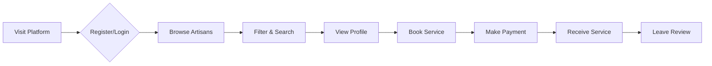
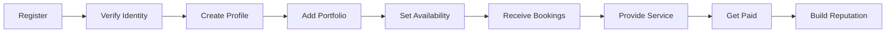

<div align="center">


# 🎨 ArtisanConnect

### *Connecting Skilled Artisans with Customers Through Web 3.0*

[](https://vuejs.org/)
[](https://tailwindcss.com/)
[](https://laravel.com/)
[](https://vitejs.dev/)
[](LICENSE)
[](CONTRIBUTING.md)

[🚀 Live Demo](#) · [📖 Documentation](#documentation) · [🐛 Report Bug](#) · [✨ Request Feature](#)

---

</div>

## 📑 Table of Contents

- [🌟 Overview](#-overview)
- [✨ Key Features](#-key-features)
- [🛠️ Technology Stack](#️-technology-stack)
- [📊 Technology Distribution](#-technology-distribution)
- [🏗️ Project Structure](#️-project-structure)
- [🚀 Getting Started](#-getting-started)
- [💻 Installation](#-installation)
- [🎯 How It Works](#-how-it-works)
- [🎨 Design System](#-design-system)
- [🔐 Security Features](#-security-features)
- [📱 Responsive Design](#-responsive-design)
- [🧪 Testing](#-testing)
- [📈 Performance](#-performance)
- [🤝 Contributing](#-contributing)
- [📄 License](#-license)
- [👥 Team](#-team)

---

## 🌟 Overview

**ArtisanConnect** is a revolutionary Web 3.0 platform that bridges the gap between skilled artisans and customers seeking quality services. Built with modern web technologies, it provides a secure, transparent, and efficient marketplace for connecting service providers with clients.

### 🎯 Mission

Empowering artisans with digital tools while providing customers with verified, trustworthy service providers through blockchain technology and modern web standards.

### 🌐 Platform Type

- **Architecture**: Single Page Application (SPA)
- **Blockchain**: Web 3.0 Integration
- **Deployment**: Cloud-ready (Vercel/Netlify/AWS)
- **Mobile**: Responsive Design (Mobile-first)

---

## ✨ Key Features

### 👥 For Customers

```
🔍 Advanced Search         → Find artisans by location, skills, ratings
⭐ Rating System           → Transparent reviews and ratings
📅 Easy Booking            → Simple scheduling and appointment system
💳 Secure Payments         → Protected transactions
🔔 Real-time Notifications → Stay updated on booking status
📱 Mobile Responsive       → Access anywhere, anytime
```

### 🛠️ For Artisans

```
📝 Professional Profiles   → Showcase skills and portfolio
💼 Job Management          → Track and manage all bookings
💰 Earnings Dashboard      → Monitor income and payments
📊 Analytics               → Understand customer behavior
🌟 Reputation Building     → Collect and display reviews
🔐 Web3 Integration        → Blockchain-verified credentials
```

### 🔒 Platform Security

```
🛡️ Web3 Authentication     → Decentralized identity verification
🔐 Encrypted Data          → End-to-end encryption
✅ Verified Profiles       → Identity and skill verification
💳 Escrow Payments         → Secure transaction handling
🔍 Background Checks       → Trust and safety measures
```

---

## 🛠️ Technology Stack

### **Frontend Technologies**

<table>
<tr>
<td width="33%" align="center">

#### ⚡ Core Framework


**Vue.js 3**
- Composition API
- Reactive Components
- Single File Components
- Vue Router Integration

</td>
<td width="33%" align="center">

#### 🎨 Styling


**Tailwind CSS**
- Utility-first CSS
- Glass-morphism Effects
- Responsive Design
- Custom Gradients

</td>
<td width="33%" align="center">

#### 🧭 Routing


**Vue Router 4**
- Client-side Navigation
- Route Guards
- Dynamic Routes
- Lazy Loading

</td>
</tr>
</table>

### **Backend Technologies**

<table>
<tr>
<td width="50%" align="center">

#### 🐘 Framework


**Laravel 10.x**
- RESTful API
- Eloquent ORM
- Authentication
- Database Migrations

</td>
<td width="50%" align="center">

#### 🗄️ Database


**MySQL**
- Relational Database
- ACID Compliance
- Data Integrity
- Performance Optimization

</td>
</tr>
</table>

### **Development & Build Tools**

| Tool | Version | Purpose | Usage |
|------|---------|---------|-------|
|  | 5.0+ | Build Tool | Hot Module Replacement, Fast Builds |
|  | 2.6+ | PHP Dependencies | Backend Package Management |
|  | 10.x | JS Dependencies | Frontend Package Management |
|  | 8.4+ | CSS Processing | Autoprefixer, CSS Optimization |

### **Additional Technologies**

```javascript
🔧 Core Libraries:
├── JavaScript ES6+     → Modern syntax, async/await, modules
├── HTML5              → Semantic markup, accessibility
├── CSS3               → Animations, transforms, flexbox/grid
├── SVG                → Scalable vector graphics for icons
├── Axios              → HTTP client for API calls
└── Laravel Sanctum    → API authentication

🔐 Security & Authentication:
├── JWT Tokens         → Secure authentication
├── Laravel Sanctum    → API token management
├── bcrypt             → Password hashing
└── CORS               → Cross-origin security

📦 State Management:
└── Pinia/Vuex         → Centralized state management
```

---

## 📊 Technology Distribution

### **Overall Stack Breakdown**

```
██████████████████████████████████████████████████████████████ Frontend (60%)
│
├─ Vue.js 3          ████████████████████████████████████ 35%
├─ Tailwind CSS      █████████████████████████ 25%
├─ Vue Router        ██████████ 10%
├─ JavaScript ES6+   ███████████████ 15%
├─ HTML5             ████████ 8%
├─ CSS3              █████ 5%
└─ Vite              ██ 2%

████████████████████████████████████████ Backend (40%)
│
├─ Laravel 10        ████████████████████████ 30%
├─ MySQL             ████████████ 15%
├─ PHP 8.2+          ██████████ 12%
├─ Composer          ████ 5%
└─ Laravel Sanctum   ███ 3%
```

### **Component-Level Technology Usage**

#### 📄 Footer Component Analysis

```vue
Footer.vue Technology Breakdown:
═══════════════════════════════════════════════════════

Tailwind CSS     ███████████████████████████████████████████████ 45%
Vue.js 3         ████████████████████████████████████████ 40%
Vue Router       ██████████ 10%
HTML5            ███ 3%
SVG Icons        ██ 2%
                 ═══════════════════════════════════════════════
                 Total: 100%

📏 Metrics:
• Total Lines: 176
• Tailwind Classes: ~91 unique utilities
• Vue Components: 1 SFC (Single File Component)
• RouterLinks: 8 navigation routes
• SVG Icons: 12 (4 social + 8 arrows)
• Responsive Breakpoints: 3 (sm, md, lg)
```

---

## 🏗️ Project Structure

```
ArtisanConnect/
│
├── 📁 frontend/                    # Vue.js Frontend Application
│   ├── 📁 public/
│   │   └── 📁 assets/              # Static assets (images, icons)
│   │       └── 6.png              # Logo image
│   │
│   ├── 📁 src/
│   │   ├── 📄 App.vue             # Root component
│   │   ├── 📄 main.js             # Application entry point
│   │   │
│   │   ├── 📁 components/         # Reusable Vue components
│   │   │   ├── Footer.vue         # ✅ Footer component (176 lines)
│   │   │   ├── Navbar.vue         # Navigation bar
│   │   │   ├── Hero.vue           # Hero section
│   │   │   ├── ArtisanCard.vue    # Artisan profile card
│   │   │   └── ReviewCard.vue     # Review display card
│   │   │
│   │   ├── 📁 views/              # Page components
│   │   │   ├── Home.vue           # Landing page
│   │   │   ├── Search.vue         # Artisan search
│   │   │   ├── Register.vue       # Artisan registration
│   │   │   ├── Profile.vue        # User/Artisan profile
│   │   │   ├── Dashboard.vue      # User dashboard
│   │   │   ├── Booking.vue        # Booking page
│   │   │   ├── About.vue          # About us
│   │   │   ├── Contact.vue        # Contact form
│   │   │   ├── Help.vue           # Help center
│   │   │   ├── Privacy.vue        # Privacy policy
│   │   │   ├── Terms.vue          # Terms of service
│   │   │   └── FAQ.vue            # FAQ page
│   │   │
│   │   ├── 📁 router/             # Vue Router configuration
│   │   │   └── index.js           # Route definitions
│   │   │
│   │   ├── 📁 stores/             # State management (Pinia)
│   │   │   ├── user.js            # User state
│   │   │   ├── artisan.js         # Artisan state
│   │   │   └── booking.js         # Booking state
│   │   │
│   │   ├── 📁 services/           # API service layer
│   │   │   ├── api.js             # Axios instance
│   │   │   ├── auth.js            # Authentication API
│   │   │   ├── artisan.js         # Artisan API
│   │   │   └── booking.js         # Booking API
│   │   │
│   │   └── 📁 assets/             # Compiled assets
│   │       ├── styles/            # Global styles
│   │       └── images/            # Image assets
│   │
│   ├── 📄 index.html              # HTML entry point
│   ├── 📄 package.json            # NPM dependencies
│   ├── 📄 vite.config.js          # Vite configuration
│   ├── 📄 tailwind.config.js      # Tailwind configuration
│   └── 📄 postcss.config.js       # PostCSS configuration
│
├── 📁 backend/                     # Laravel Backend API
│   ├── 📁 app/
│   │   ├── 📁 Http/
│   │   │   ├── 📁 Controllers/    # API controllers
│   │   │   │   ├── AuthController.php
│   │   │   │   ├── ArtisanController.php
│   │   │   │   ├── BookingController.php
│   │   │   │   ├── ReviewController.php
│   │   │   │   └── ServiceController.php
│   │   │   │
│   │   │   ├── 📁 Middleware/     # HTTP middleware
│   │   │   │   ├── Authenticate.php
│   │   │   │   └── VerifyArtisan.php
│   │   │   │
│   │   │   └── Kernel.php         # HTTP kernel
│   │   │
│   │   ├── 📁 Models/             # Eloquent models
│   │   │   ├── User.php           # ✅ User model
│   │   │   ├── ArtisanProfile.php # ✅ Artisan profile
│   │   │   ├── Service.php        # ✅ Service model
│   │   │   └── Review.php         # ✅ Review model
│   │   │
│   │   └── 📁 Providers/          # Service providers
│   │       ├── AppServiceProvider.php
│   │       ├── AuthServiceProvider.php
│   │       └── RouteServiceProvider.php
│   │
│   ├── 📁 config/                 # Configuration files
│   │   ├── app.php
│   │   ├── database.php
│   │   ├── sanctum.php
│   │   └── cors.php
│   │
│   ├── 📁 database/
│   │   ├── 📁 migrations/         # Database migrations
│   │   │   ├── 2024_01_01_000000_create_users_table.php
│   │   │   ├── 2024_01_01_000001_create_artisan_profiles_table.php
│   │   │   ├── 2024_01_01_000002_create_services_table.php
│   │   │   └── 2024_01_01_000003_create_reviews_table.php
│   │   │
│   │   └── 📁 seeders/            # Database seeders
│   │       └── DatabaseSeeder.php
│   │
│   ├── 📁 routes/                 # API routes
│   │   ├── api.php                # API endpoints
│   │   ├── web.php                # Web routes
│   │   └── console.php            # Console routes
│   │
│   ├── 📁 storage/                # Storage directory
│   │   ├── 📁 app/
│   │   ├── 📁 framework/
│   │   └── 📁 logs/
│   │
│   ├── 📄 composer.json           # PHP dependencies
│   ├── 📄 artisan                 # Laravel CLI
│   └── 📄 setup.ps1               # Setup script
│
├── 📄 README.md                    # This file
├── 📄 PROJECT_SUMMARY.md           # Project summary
├── 📄 API_DOCUMENTATION.md         # API documentation
├── 📄 INSTALLATION_CHECKLIST.md    # Installation guide
├── 📄 TESTING_GUIDE.md             # Testing guidelines
└── 📄 LICENSE                      # License file
```

---

## 🚀 Getting Started

### Prerequisites

Before you begin, ensure you have the following installed:

```bash
✅ Node.js (v18.0 or higher)
✅ NPM (v10.0 or higher)
✅ PHP (v8.2 or higher)
✅ Composer (v2.6 or higher)
✅ MySQL (v8.0 or higher)
✅ Git
```

### Quick Start

```bash
# Clone the repository
git clone https://github.com/your-username/artisanconnect.git
cd artisanconnect

# Install frontend dependencies
cd frontend
npm install

# Install backend dependencies
cd ../backend
composer install

# Start development servers
npm run dev        # Frontend (port 5173)
php artisan serve  # Backend (port 8000)
```

---

## 💻 Installation

### 📦 Step-by-Step Installation Guide

#### 1️⃣ **Frontend Setup**

```bash
# Navigate to frontend directory
cd frontend

# Install dependencies
npm install

# Configure environment
cp .env.example .env

# Update .env with your settings
VITE_API_URL=http://localhost:8000/api
VITE_APP_NAME=ArtisanConnect

# Start development server
npm run dev

# Build for production
npm run build

# Preview production build
npm run preview
```

#### 2️⃣ **Backend Setup**

```bash
# Navigate to backend directory
cd backend

# Install PHP dependencies
composer install

# Configure environment
cp .env.example .env

# Generate application key
php artisan key:generate

# Configure database in .env
DB_CONNECTION=mysql
DB_HOST=127.0.0.1
DB_PORT=3306
DB_DATABASE=artisanconnect
DB_USERNAME=root
DB_PASSWORD=your_password

# Run migrations
php artisan migrate

# Seed database (optional)
php artisan db:seed

# Start Laravel server
php artisan serve
```

#### 3️⃣ **Database Setup**

```sql
-- Create database
CREATE DATABASE artisanconnect CHARACTER SET utf8mb4 COLLATE utf8mb4_unicode_ci;

-- Create user (optional)
CREATE USER 'artisan_user'@'localhost' IDENTIFIED BY 'secure_password';
GRANT ALL PRIVILEGES ON artisanconnect.* TO 'artisan_user'@'localhost';
FLUSH PRIVILEGES;
```

#### 4️⃣ **Run Migrations**

```bash
# Run all migrations
php artisan migrate

# Refresh migrations (caution: drops all tables)
php artisan migrate:fresh

# Run with seeders
php artisan migrate:fresh --seed
```

---

## 🎯 How It Works

### 🔄 User Journey - Customer



**Detailed Flow:**

1. **Discovery** 🔍
   - Visit homepage
   - Browse featured artisans
   - Use search with filters (location, category, rating, price)

2. **Selection** ✅
   - View detailed artisan profiles
   - Check portfolio and past work
   - Read customer reviews
   - Compare prices and availability

3. **Booking** 📅
   - Select service and date
   - Fill booking details
   - Confirm appointment

4. **Payment** 💳
   - Secure payment processing
   - Multiple payment methods
   - Transaction confirmation

5. **Service** 🛠️
   - Receive service from artisan
   - Track service progress
   - Direct communication

6. **Review** ⭐
   - Rate experience (1-5 stars)
   - Write detailed review
   - Upload photos/videos

### 🔄 User Journey - Artisan



**Detailed Flow:**

1. **Registration** 📝
   - Create artisan account
   - Provide business details
   - Upload certifications

2. **Verification** ✅
   - Identity verification
   - Skill certification
   - Background check

3. **Profile Setup** 🎨
   - Add profile photo
   - Write bio and description
   - Upload portfolio images
   - Set service categories
   - Define pricing structure

4. **Manage Bookings** 📊
   - Receive booking requests
   - Accept/decline bookings
   - Manage schedule
   - Communicate with clients

5. **Service Delivery** 🛠️
   - Complete booked services
   - Update service status
   - Upload completion photos

6. **Get Paid** 💰
   - Automatic payment release
   - View earnings dashboard
   - Withdraw funds

7. **Build Reputation** 🌟
   - Collect reviews
   - Earn badges
   - Increase visibility

---

## 🎨 Design System

### 🎨 Color Palette

```css
/* Primary Colors */
--primary-400: #60A5FA;    /* Light Blue */
--primary-500: #3B82F6;    /* Blue */

/* Secondary Colors */
--purple-400: #C084FC;     /* Light Purple */
--purple-500: #A855F7;     /* Purple */

/* Accent Colors */
--pink-500: #EC4899;       /* Pink */

/* Neutral Colors */
--white: #FFFFFF;
--gray-300: #D1D5DB;
--gray-400: #9CA3AF;
--gray-900: #111827;

/* Transparency Levels */
--white-5: rgba(255, 255, 255, 0.05);
--white-10: rgba(255, 255, 255, 0.1);
--white-30: rgba(255, 255, 255, 0.3);
```

### 🎭 Design Principles

#### 1. **Glass-morphism Effects**

```css
.glass-dark {
  background: rgba(255, 255, 255, 0.05);
  backdrop-filter: blur(20px);
  border: 1px solid rgba(255, 255, 255, 0.1);
  box-shadow: 0 8px 32px 0 rgba(31, 38, 135, 0.37);
}
```

#### 2. **Gradient Text**

```css
.gradient-text {
  background: linear-gradient(to right, #60A5FA, #A855F7, #EC4899);
  -webkit-background-clip: text;
  -webkit-text-fill-color: transparent;
  background-clip: text;
}
```

#### 3. **Hover Animations**

```css
.hover-lift {
  transition: all 0.3s ease;
}

.hover-lift:hover {
  transform: translateY(-4px) scale(1.1);
  box-shadow: 0 20px 25px -5px rgba(0, 0, 0, 0.1);
}
```

### 📐 Typography

| Element | Font Size | Font Weight | Line Height |
|---------|-----------|-------------|-------------|
| H1 | 3rem (48px) | 800 (Black) | 1.2 |
| H2 | 2rem (32px) | 700 (Bold) | 1.3 |
| H3 | 1.5rem (24px) | 600 (Semibold) | 1.4 |
| Body | 1rem (16px) | 400 (Regular) | 1.6 |
| Small | 0.875rem (14px) | 400 (Regular) | 1.5 |
| Caption | 0.75rem (12px) | 400 (Regular) | 1.4 |

### 🎯 Component Library

#### **Buttons**

```html
<!-- Primary Button -->
<button class="px-6 py-3 bg-gradient-to-r from-primary-400 via-purple-500 to-pink-500 
               text-white rounded-xl font-semibold hover:scale-105 transition-all">
  Button Text
</button>

<!-- Secondary Button -->
<button class="px-6 py-3 border border-white/30 text-white rounded-xl 
               hover:bg-white/10 transition-all">
  Button Text
</button>

<!-- Icon Button -->
<button class="w-12 h-12 flex items-center justify-center rounded-full 
               bg-white/5 hover:bg-primary-500/20 transition-all">
  <svg>...</svg>
</button>
```

#### **Cards**

```html
<!-- Glass Card -->
<div class="glass-dark rounded-xl p-6 border border-white/10">
  <h3 class="text-xl font-bold text-white mb-4">Card Title</h3>
  <p class="text-gray-400">Card content goes here...</p>
</div>

<!-- Hover Card -->
<div class="glass-dark rounded-xl p-6 hover:scale-105 
            hover:-translate-y-1 transition-all cursor-pointer">
  Content
</div>
```

---

## 🔐 Security Features

### 🛡️ Implementation

```javascript
Security Layers:
├── 🔐 Authentication
│   ├── Laravel Sanctum token-based auth
│   ├── JWT tokens for API access
│   ├── Password hashing (bcrypt)
│   └── Session management
│
├── 🔒 Authorization
│   ├── Role-based access control (RBAC)
│   ├── Permission middleware
│   └── API route protection
│
├── 🛡️ Data Protection
│   ├── HTTPS/SSL encryption
│   ├── SQL injection prevention
│   ├── XSS protection
│   ├── CSRF tokens
│   └── Input validation & sanitization
│
├── 🔍 Verification
│   ├── Email verification
│   ├── Phone number verification
│   ├── Identity document verification
│   └── Skill certification validation
│
└── 💳 Payment Security
    ├── PCI DSS compliance
    ├── Escrow system
    ├── Encrypted payment data
    └── Fraud detection
```

### 🔒 Best Practices

```php
// Backend Security Examples

// 1. Route Protection
Route::middleware('auth:sanctum')->group(function () {
    Route::get('/profile', [ProfileController::class, 'show']);
    Route::post('/booking', [BookingController::class, 'store']);
});

// 2. Input Validation
$request->validate([
    'email' => 'required|email|unique:users',
    'password' => 'required|min:8|confirmed',
    'phone' => 'required|regex:/^[0-9]{10}$/',
]);

// 3. SQL Injection Prevention (Eloquent ORM)
User::where('email', $email)->first(); // Safe
// Never: DB::raw("SELECT * FROM users WHERE email = '$email'"); // Unsafe

// 4. XSS Protection
{{ $user->name }} // Auto-escaped in Blade
{!! $dangerousHTML !!} // Only when necessary

// 5. Password Hashing
$hashedPassword = Hash::make($password);
```

---

## 📱 Responsive Design

### 📐 Breakpoints

```css
/* Mobile First Approach */

/* Extra Small - Mobile Portrait */
/* Default: 320px - 639px */

/* Small - Mobile Landscape / Small Tablets */
@media (min-width: 640px) { /* sm: */ }

/* Medium - Tablets */
@media (min-width: 768px) { /* md: */ }

/* Large - Laptops */
@media (min-width: 1024px) { /* lg: */ }

/* Extra Large - Desktops */
@media (min-width: 1280px) { /* xl: */ }

/* 2X Large - Large Desktops */
@media (min-width: 1536px) { /* 2xl: */ }
```

### 📱 Responsive Examples

```html
<!-- Responsive Grid -->
<div class="grid grid-cols-1 md:grid-cols-2 lg:grid-cols-4 gap-6">
  <!-- Content adapts: 1 col mobile, 2 cols tablet, 4 cols desktop -->
</div>

<!-- Responsive Padding -->
<div class="px-4 sm:px-6 lg:px-8">
  <!-- Padding: 16px mobile, 24px tablet, 32px desktop -->
</div>

<!-- Responsive Text -->
<h1 class="text-2xl md:text-4xl lg:text-5xl">
  <!-- Size: 24px mobile, 36px tablet, 48px desktop -->
</h1>

<!-- Responsive Display -->
<div class="flex flex-col md:flex-row">
  <!-- Column on mobile, row on tablet+ -->
</div>
```

---

## 🧪 Testing

### 🔬 Testing Strategy

```bash
# Frontend Tests
cd frontend
npm run test        # Run all tests
npm run test:unit   # Unit tests
npm run test:e2e    # End-to-end tests

# Backend Tests
cd backend
php artisan test    # Run all tests
php artisan test --filter=UserTest  # Specific test
```

### 📝 Test Coverage

```
Backend Tests:
├── Unit Tests
│   ├── Models (User, Artisan, Service, Review)
│   ├── Helpers & Utilities
│   └── Business Logic
│
├── Feature Tests
│   ├── API Endpoints
│   ├── Authentication Flow
│   ├── Booking System
│   └── Payment Processing
│
└── Integration Tests
    ├── Database Operations
    ├── External API Calls
    └── Service Interactions

Frontend Tests:
├── Component Tests
│   ├── Footer.vue
│   ├── Navbar.vue
│   ├── ArtisanCard.vue
│   └── ReviewCard.vue
│
├── View Tests
│   ├── Home Page
│   ├── Search Page
│   ├── Profile Page
│   └── Booking Flow
│
└── E2E Tests
    ├── User Registration
    ├── Login Flow
    ├── Complete Booking
    └── Review Submission
```

---

## 📈 Performance

### ⚡ Optimization Techniques

```javascript
Performance Features:
├── 🚀 Code Splitting
│   └── Route-based lazy loading
│
├── 📦 Asset Optimization
│   ├── Image compression (WebP format)
│   ├── SVG optimization
│   ├── CSS minification
│   └── JavaScript minification
│
├── 🗄️ Caching Strategy
│   ├── Browser caching
│   ├── API response caching
│   ├── Database query caching
│   └── Static asset CDN
│
├── 🔄 Lazy Loading
│   ├── Component lazy loading
│   ├── Image lazy loading
│   └── Route lazy loading
│
└── 📊 Bundle Optimization
    ├── Tree shaking
    ├── Code splitting
    ├── Vendor chunk separation
    └── Dynamic imports
```

### 📊 Performance Metrics

```
Target Performance:
├── First Contentful Paint (FCP)    < 1.5s
├── Largest Contentful Paint (LCP)  < 2.5s
├── Time to Interactive (TTI)       < 3.0s
├── Cumulative Layout Shift (CLS)   < 0.1
└── First Input Delay (FID)         < 100ms
```

---

## 🤝 Contributing

We welcome contributions! Here's how you can help:

### 📋 Contribution Guidelines

1. **Fork the Repository**
```bash
git clone https://github.com/your-username/artisanconnect.git
cd artisanconnect
```

2. **Create a Feature Branch**
```bash
git checkout -b feature/amazing-feature
```

3. **Make Your Changes**
```bash
# Make changes
git add .
git commit -m "Add amazing feature"
```

4. **Push to Your Fork**
```bash
git push origin feature/amazing-feature
```

5. **Open a Pull Request**
   - Go to GitHub
   - Click "New Pull Request"
   - Describe your changes
   - Submit for review

### 📝 Code Standards

```javascript
// Follow these standards:

✅ Use meaningful variable names
✅ Write comments for complex logic
✅ Follow Vue.js style guide
✅ Use Tailwind utility classes
✅ Follow Laravel conventions
✅ Write tests for new features
✅ Update documentation
✅ Keep commits atomic and descriptive
```

---

## 📄 License

This project is licensed under the **MIT License** - see the [LICENSE](LICENSE) file for details.

```
MIT License

Copyright (c) 2025 ArtisanConnect

Permission is hereby granted, free of charge, to any person obtaining a copy
of this software and associated documentation files (the "Software"), to deal
in the Software without restriction, including without limitation the rights
to use, copy, modify, merge, publish, distribute, sublicense, and/or sell
copies of the Software, and to permit persons to whom the Software is
furnished to do so, subject to the following conditions:

[Full MIT License Text...]
```

---

## 👥 Team

<div align="center">

### 🌟 Core Team

| Role | Responsibility |
|------|----------------|
| **Project Lead** | Overall vision and architecture |
| **Frontend Developer** | Vue.js, UI/UX implementation |
| **Backend Developer** | Laravel API, database design |
| **UI/UX Designer** | Design system, user experience |
| **DevOps Engineer** | Deployment, CI/CD, infrastructure |
| **QA Engineer** | Testing, quality assurance |

</div>

---

## 📞 Contact & Support

<div align="center">

### Get in Touch

[](https://artisanconnect.com)
[](mailto:support@artisanconnect.com)
[](https://twitter.com/artisanconnect)
[](https://discord.gg/artisanconnect)

### 📚 Additional Resources

[📖 Full Documentation](docs/) · [🎥 Video Tutorials](tutorials/) · [💬 Community Forum](forum/) · [❓ FAQ](FAQ.md)

</div>

---

## 🗺️ Roadmap

### 🎯 Current Version: v1.0.0

### 📅 Future Plans

```
Q1 2025
├── ✅ Launch MVP
├── ✅ Core features implementation
├── ✅ Beta testing
└── ✅ Public release

Q2 2025
├── 🔄 Mobile app (iOS & Android)
├── 🔄 AI-powered recommendations
├── 🔄 Video consultation feature
├── 🔄 Multi-language support
└── 🔄 Advanced analytics dashboard

Q3 2025
├── 📋 NFT certificates for completed work
├── 📋 Blockchain payment integration
├── 📋 Smart contract escrow
├── 📋 Decentralized identity verification
└── 📋 Community governance (DAO)

Q4 2025
├── 📋 International expansion
├── 📋 Enterprise features
├── 📋 White-label solutions
└── 📋 API for third-party integrations
```

---

## 🌟 Acknowledgments

Special thanks to:

- **Vue.js Team** - For the amazing framework
- **Laravel Team** - For the robust backend framework
- **Tailwind CSS Team** - For the utility-first CSS framework
- **Open Source Community** - For countless libraries and tools
- **Beta Testers** - For valuable feedback
- **Contributors** - For improving the platform

---

## 📊 Project Statistics

<div align="center">


</div>

---

## 🎓 Learning Resources

### 📚 For Developers

```
Vue.js Resources:
├── Official Docs: https://vuejs.org/guide
├── Vue Router: https://router.vuejs.org
├── Pinia: https://pinia.vuejs.org
└── Vue School: https://vueschool.io

Laravel Resources:
├── Official Docs: https://laravel.com/docs
├── Laracasts: https://laracasts.com
├── Laravel News: https://laravel-news.com
└── Laravel Daily: https://laraveldaily.com

Tailwind CSS:
├── Official Docs: https://tailwindcss.com/docs
├── Tailwind UI: https://tailwindui.com
└── Headless UI: https://headlessui.com
```

---

## ⚙️ Environment Variables

### Frontend `.env`

```bash
# API Configuration
VITE_API_URL=http://localhost:8000/api
VITE_API_TIMEOUT=30000

# Application
VITE_APP_NAME=ArtisanConnect
VITE_APP_URL=http://localhost:5173

# Web3 Configuration
VITE_WEB3_ENABLED=true
VITE_CHAIN_ID=1

# Feature Flags
VITE_ENABLE_PAYMENTS=true
VITE_ENABLE_CHAT=true
```

### Backend `.env`

```bash
# Application
APP_NAME=ArtisanConnect
APP_ENV=local
APP_KEY=base64:...
APP_DEBUG=true
APP_URL=http://localhost:8000

# Database
DB_CONNECTION=mysql
DB_HOST=127.0.0.1
DB_PORT=3306
DB_DATABASE=artisanconnect
DB_USERNAME=root
DB_PASSWORD=

# Sanctum
SANCTUM_STATEFUL_DOMAINS=localhost:5173
SESSION_DOMAIN=localhost

# Mail
MAIL_MAILER=smtp
MAIL_HOST=smtp.mailtrap.io
MAIL_PORT=2525
MAIL_USERNAME=null
MAIL_PASSWORD=null

# AWS S3 (for file uploads)
AWS_ACCESS_KEY_ID=
AWS_SECRET_ACCESS_KEY=
AWS_DEFAULT_REGION=us-east-1
AWS_BUCKET=
```

---

<div align="center">

## 🚀 Ready to Get Started?

```bash
git clone https://github.com/your-username/artisanconnect.git
cd artisanconnect
npm install && composer install
npm run dev
```

### ⭐ Star us on GitHub if you like this project!

---

**Built with 💜 by the ArtisanConnect Team**

*Empowering Artisans, Connecting Communities*

---

[](https://vuejs.org/)
[](https://laravel.com/)
[](https://tailwindcss.com/)

</div>
